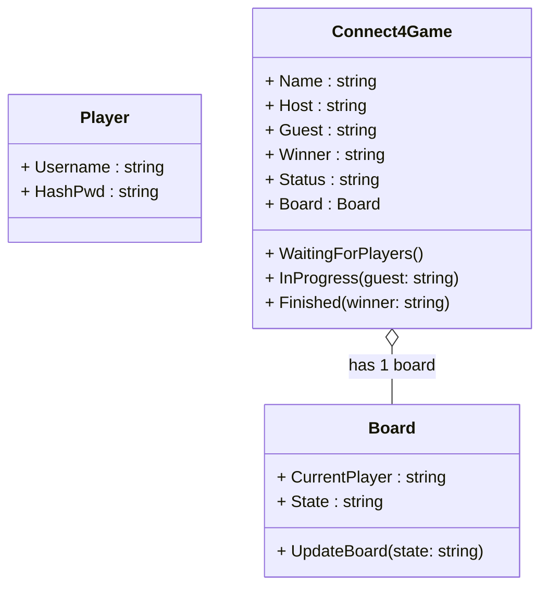
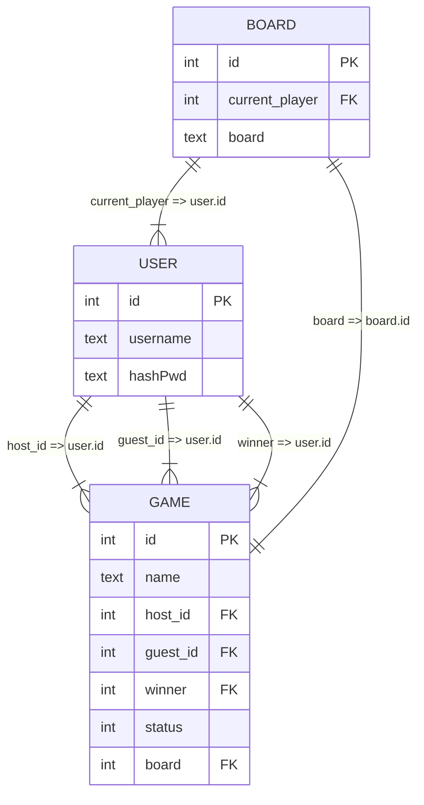

# Domain & Database Diagrams

This document provides an overview of the **Connect4** domain model and the corresponding **database schema**. Both diagrams use [Mermaid](https://mermaid.js.org/) syntax.


## 1. Domain Model Diagram
Below is a **class diagram** for the key domain entities:



## 2. Database Schema Diagram

Below is an ER (Entity-Relationship) diagram showing how the domain entities map to database tables:



### Notes
- guest_id and winner can be NULL, since a guest player or a winner may not exist yet.
- current_player in the board table could reference a user if desired, but in the C# domain model it’s stored as a string property.
- The board table’s board field is a serialized representation of the Connect4 grid (e.g., "0000000;0000000;...").


## Additional Remarks

### Domain Model vs. DB Schema
The domain model uses classes that reference each other directly (e.g., Connect4Game has a Board object, user references by string for Host, Guest), while the database schema uses foreign keys (host_id, guest_id, etc.) to link rows.


### Mermaid Support

These diagrams rely on Mermaid syntax (```mermaid). If using Doxygen or GitHub/GitLab, ensure Mermaid is enabled or use an external tool to render the diagrams into images for inclusion.